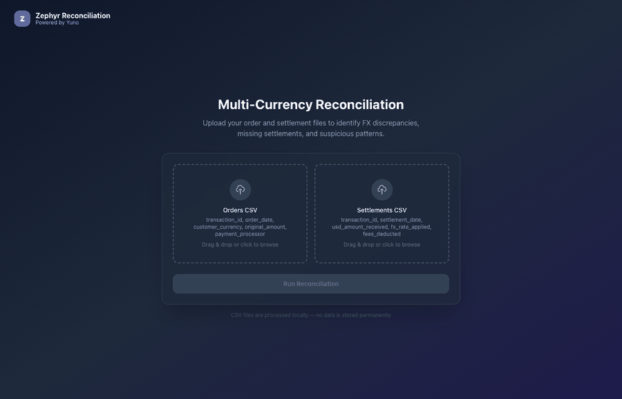
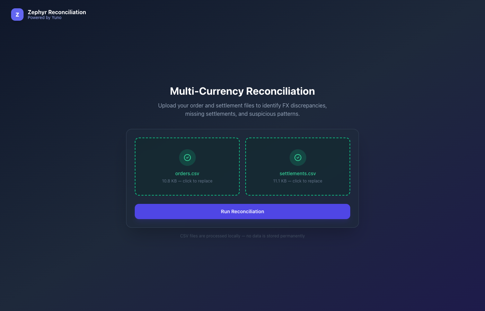
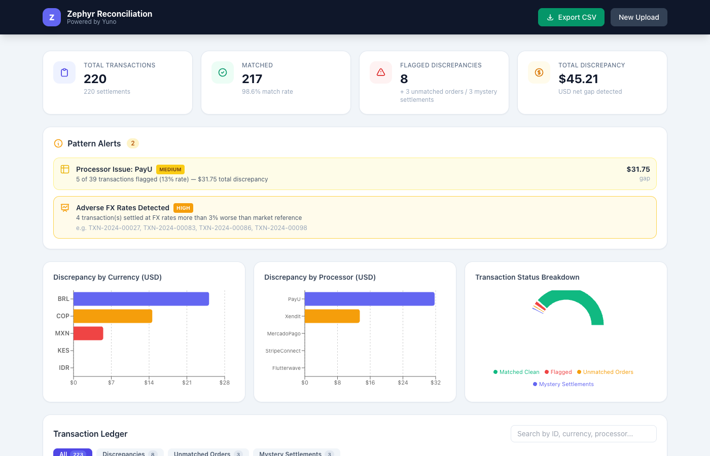
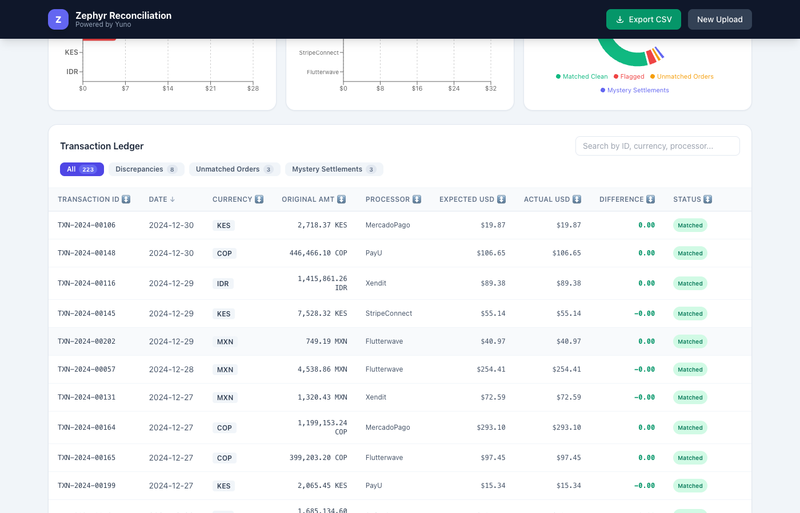
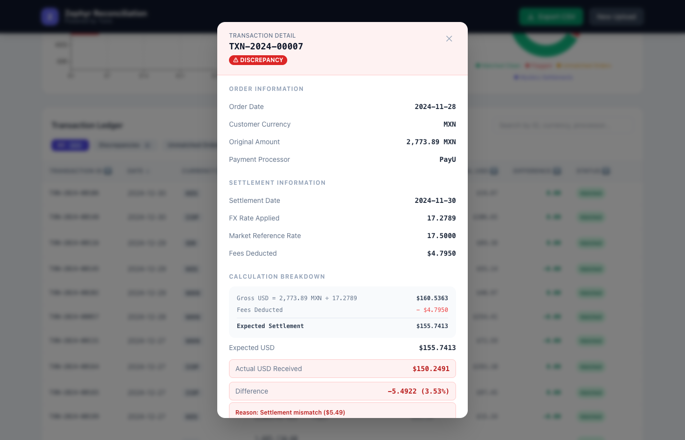

# Zephyr Multi-Currency Reconciliation Tool

> Powered by Yuno — Built for Zephyr Global's finance team

A full-stack reconciliation tool to upload order and settlement CSVs, detect FX discrepancies, identify missing or mystery transactions, and drill into every flagged record.

---

## Demo



---

## Screenshots

| Upload | Files Selected |
|--------|---------------|
|  |  |

| Dashboard | Transaction Ledger |
|-----------|-------------------|
|  |  |

**Drill-down modal — full calculation breakdown:**



---

## Quick Start (5 minutes)

### Prerequisites
- Python 3.9+
- Node.js 18+

### 1. Backend

```bash
cd backend
pip install -r requirements.txt
uvicorn main:app --reload --port 8000
```

Backend runs at `http://localhost:8000`. Health check: `GET /api/health`

### 2. Frontend

```bash
cd frontend
npm install
npm run dev
```

Frontend runs at `http://localhost:5173`. Open it in your browser.

### 3. Upload test data

The `test-data/` directory contains ready-to-use CSV files with injected discrepancies:

| File | Records | Description |
|------|---------|-------------|
| `orders.csv` | 220 | Zephyr's order ledger (MXN, BRL, IDR, KES, COP) |
| `settlements.csv` | 220 | Yuno settlement report (217 matched + 3 mystery) |

Drag both files into the upload screen and click **Run Reconciliation**.

---

## Injected Discrepancies (What to Look For)

| Type | Count | Details |
|------|-------|---------|
| PayU calculation errors | 5 | `usd_amount_received` is off from the expected formula |
| Xendit calculation errors | 3 | Same — settlement amount doesn't match calculation |
| MercadoPago bad FX (BRL) | 4 | FX rate is 5–10% worse than market; detected via pattern alert |
| Missing settlements | 3 | Orders with no matching settlement record |
| Mystery settlements | 3 | Settlements with no matching order |

---

## How It Works

**Matching Engine:**
- Joins orders ↔ settlements by `transaction_id`
- Computes: `expected_usd = (original_amount / fx_rate_applied) - fees_deducted`
- Flags if `|actual_usd - expected_usd| > $0.50`

**Pattern Detection:**
- Processor anomaly: ≥2 flagged transactions from same processor
- Currency anomaly: ≥15% discrepancy rate for a currency
- Large discrepancy: any gap > $50
- Adverse FX: rate is >3% worse than market reference

---

## Project Structure

```
├── backend/
│   ├── main.py          # FastAPI app — parsing, reconciliation, pattern detection
│   └── requirements.txt
├── frontend/
│   └── src/
│       ├── App.tsx
│       ├── types.ts
│       └── components/
│           ├── FileUpload.tsx
│           ├── SummaryCards.tsx
│           ├── AlertsPanel.tsx
│           ├── Charts.tsx
│           ├── DiscrepancyTable.tsx
│           └── TransactionModal.tsx
├── test-data/
│   ├── orders.csv
│   ├── settlements.csv
│   └── generate_data.py   # Regenerate test data
├── docs/
│   ├── demo.gif           # Animated demo
│   └── screenshot-*.png   # Individual screenshots
├── ARCHITECTURE.md
└── README.md
```

---

## API

`POST /api/reconcile`
Multipart form upload with `orders_file` and `settlements_file`.
Returns full reconciliation result including transactions, pattern alerts, and aggregated stats.

---

## Regenerating Test Data

```bash
cd test-data
python3 generate_data.py
```
